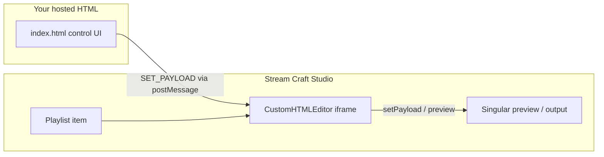

# Action Network control panel (Stream Craft Studio)

This project provides an Action Network custom HTML control panel with game count, per-game settings (colors, data window, stat type), and transition controls. It integrates with **Stream Craft Studio** through the `IframeClient` bridge.

## How it fits together



1. **Singular composition** — Subcomposition includes a `customHTML` control node (studio auto-detects this and sets editor type to `customHTML`).
2. **Studio settings** — For that subcomposition: Editor = **Custom HTML**, URL = hosted `index.html` (see below).
3. **Playlist** — Add an item on that logic layer; selecting it loads your control page in the item editor.
4. **Control page** — Uses `IframeClient` to push payload keys into Singular preview.

## Payload format

This control outputs payload keys such as:

- `away_team_full_name1`, `home_team_logo1`, `away_team_color1`, …
- `oneStat1` / `allStats1`, `game_customStat1`, `odds_spread_away_public1`, …
- `Transition`, `TransitionText`, `TransitionTypeTeam`, …
- `gamesNumber`

Games are loaded from a Singular Action Network datanode. Control values used by this panel are: `primary_color` / `secondary_color`, `odds` / `firsthalf_odds`, `SPREAD` / `MONEYLINE` / `O/U` / `allStats`.

## Host the control page

### Option A — Stream Craft hosting (recommended)

1. Create a project in `stream-craft-studio-hosting`.
2. Upload `index.html` and `iframe-client.js` (same folder).
3. Publish the project.
4. Use the live URL, e.g.  
   `https://your-host/api/live/{projectId}/index.html`

### Option B — Local dev

From this repository:

```bash
npx serve .
```

Then open:

**http://localhost:3000/index.html**

Use that URL as the Custom HTML URL in studio settings (studio appends `?iframeId=...` when loading the iframe). The terminal also prints this link when the dev server starts.

### Option C — Refresh iframe client from control app

```bash
cd stream-craft-studio-control
npm run build:iframe
cp dist/iframe/iframe-client.js ../action-network-control/
```

## Studio configuration checklist

1. Load your Singular app in Stream Craft Studio.
2. **Settings → Editor configuration** — For the sports subcomposition:
   - Editor: **Custom HTML**
   - URL: your hosted `index.html`
3. Add a playlist item on that layer.
4. Select the item — the panel appears in the item editor; Singular preview updates as you change controls.
5. Use **Update** when the graphic is **In** on program to push changes to output.

## Action Network data

Wire game dropdowns to live Action Network IDs from your own API or datanode:

```javascript
async function loadGames() {
  const res = await fetch("https://your-api/events");
  const events = await res.json();
  // populate selects, then schedulePush()
}
```

Inactive IDs ("ID NOT ACTIVE" warning) should be handled in your API layer when a saved `gameId` is no longer on the slate.

## Related code in this repo

- `stream-craft-studio-control/src/components/itemEditor/CustomHTMLEditor.tsx` — iframe host
- `stream-craft-studio-control/src/lib/iframe-client.ts` — bridge library
- `stream-craft-studio-control/src/services/IframeMessageService.ts` — message routing
